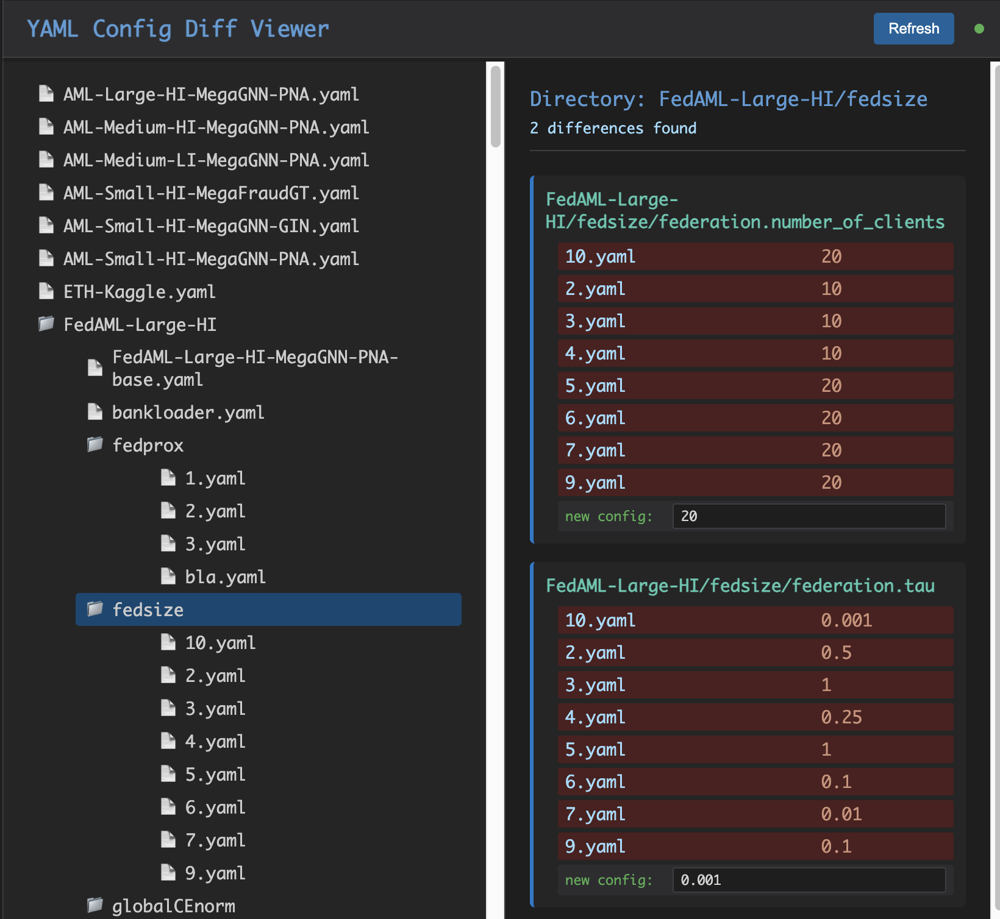

# YAML Config Tool

Tool to visualize differences between YAML configuration files, create new configurations, and submit SLURM jobs. Speeds up experiment turnover time.



# Setup and Run

One-time setup
1. Clone repository `git clone https://github.com/LourensT/yamltool.git`
2. go into the directory `cd yamltool`
3. Edit `config.json` to match your paths and settings
  * Most important are the paths. 
    * `configs_directory`: Directory containing your YAML config files
    * `working_directory`: Directory for temporary files (can be the yamltool directory)
    * `slurm_template_file`: Path to your SLURM job submission example. **The tool assumes that the location of this file is from where slurmjobs should be submitted!**
4. Create a `secret.txt` file with two lines: one with your username and one with your netid pwd. 
5. Make a virtualenv (python 3.10 or above)
  * When using venv: 
  ```bash
  python -m venv venv
  source venv/bin/activate
  ```
  * when using conda: 
  ```bash
  conda create --name yamltool python=3.10
  conda activate yamltool
  ```
6. While in active virtual environment
```bash
pip install flask pyyaml watchdog pexpect
```
Run

7. Run `python app.py`
8. Open http://localhost:5000 or as specified in config
      - if yamltool is running on your workstation, do `ssh -L 5000:localhost:5000 user@remote_host` 
      - if using VPN, use the VS Code Simple Browser! (Cmd + Shift + P, search "Simple Browser")


## SLURM Template

If you provide a `slurm_template_file` in your configuration, the tool will use it as a template for job submissions. The template can include placeholders:

- `{job_name}` - Job name
- `{memory}` - Memory allocation
- `{config_path}` - Path to config file
- `{gpu_line}` - GPU allocation line (if GPU requested)
- `{partition}` - SLURM partition
- `{time}` - Time limit
- `{nodes}` - Number of nodes
- `{output_pattern}` - Output file pattern
- `{error_pattern}` - Error file pattern

Example template:
```bash
#!/bin/sh
#SBATCH --job-name={job_name}
#SBATCH --partition={partition}
#SBATCH --time={time}
#SBATCH --nodes={nodes}
#SBATCH --mem={memory}
{gpu_line}
#SBATCH --output={output_pattern}
#SBATCH --error={error_pattern}

# Your job commands here
python your_script.py --config {config_path}
```
